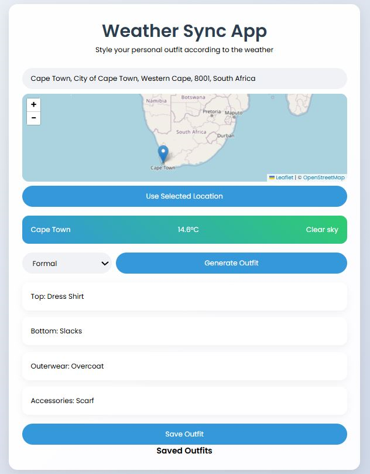

# 🌤️ Weather App

A responsive weather application that provides real-time weather updates and location search functionality using interactive maps. Built using HTML, CSS, JavaScript, and public APIs, this app offers a smooth user experience with geolocation and weather integration.

## 🚀 Features

* 🌦️ **Current Weather Forecast**: Fetches and displays temperature, wind speed, precipitation, and more for any searched location.
* 🗺️ **Interactive Map**: Users can click or search for a location on a map to view the weather.
* 🔍 **Geocoding Support**: Location search powered by OpenStreetMap and Leaflet.
* 🧭 **User-Friendly UI**: Responsive design for both desktop and mobile devices.
* ❌ **Error Handling**: Handles missing/invalid location inputs gracefully.

## 🛠️ Technologies Used

* **HTML5** – for structuring the application.
* **CSS3** – for styling and responsive layout.
* **Vanilla JavaScript (ES6)** – for dynamic interactivity and logic.
* **Leaflet.js** – for rendering the interactive map.
* **OpenStreetMap** – for map tiles and geolocation.
* **Open-Meteo API** – for fetching real-time weather data.

## 🔧 Getting Started

### Prerequisites

* A modern web browser (Chrome, Firefox, Edge, Safari).
* No backend or server setup is required.

### Installation

1. **Clone the repository:**

   ```bash
   git clone https://github.com/SirTebz/Weather-app.git
   cd Weather-app
   ```

2. **Open the app:**

   Simply open `index.html` in your browser.


## 🖼️ Screenshots



## 🤝 Contributing

Contributions are welcome! Feel free to fork this repository and submit a pull request with improvements or new features.
